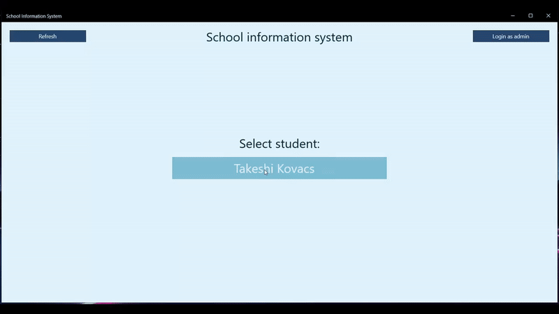
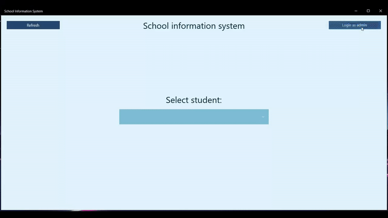

# ICS Project 2024 - School Information System

A cross-platform application built using .NET MAUI. This application is designed to manage and provide information for a school, including student data, class schedules, and other administrative tasks.

### Student view

### Admin view

## Features

- **Student Management**: Maintain detailed records of student information including names, photos, and subjects enrolled.
- **Class Scheduling**: Manage and view schedules for classes, exams, and other activities.
- **Teacher Information**: Store and manage information related to teachers.
- **Administrative Task Management**: Handle various administrative tasks and track their progress.

## Project Structure

The project is organized into several layers to ensure a clean separation of concerns and maintainability:

### 1. App Layer
- **project.App**: The main entry point for the application, containing the user interface and presentation logic.
- **Views**: Contains the XAML files for the UI.
- **ViewModels**: Contains the logic for interacting with the views.

### 2. Business Logic (BL) Layer
- **project.BL**: Contains the business logic and application services. This layer processes data from the DAL and sends it to the presentation layer.

### 3. Data Access Layer (DAL)
- **project.DAL**: Manages database access using Entity Framework Core. This layer handles the CRUD operations and data persistence.
- **Entities**: Defines the database entities.
- **DbContext**: Contains the database context for Entity Framework Core.
  
### 4. Common Layer
- **project.Common**: Contains shared code and utilities used across the application.

### 5. Tests
- **project.Tests**: Contains unit and integration tests to ensure the functionality and reliability of the application.

## Installation

### Prerequisites
- .NET 8 SDK or later

### Setup and usage
1. Clone the repository: `git clone https://github.com/stan-leetasi/school-information-system.git`
2. Restore the dependencies: `dotnet restore`
3. Build the project: `dotnet build`
4. The application will be installed on your Windows machine under the name "project.App"
5. To remove the application: `dotnet clean`

## Development team 
- Andrii Balatsyr (xbalat00)
- Adam Kán (xkanad00)
- Michal Krulich (xkruli03)
- Stanislav Letaši (xletas00)
- Jiří Tesař (xtesar44)

